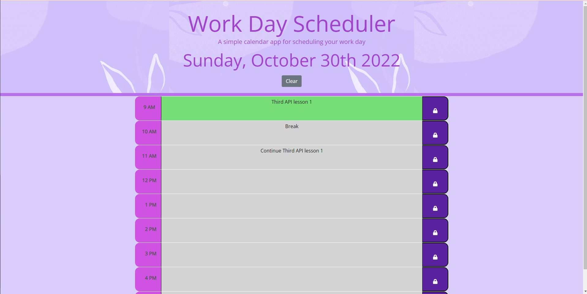
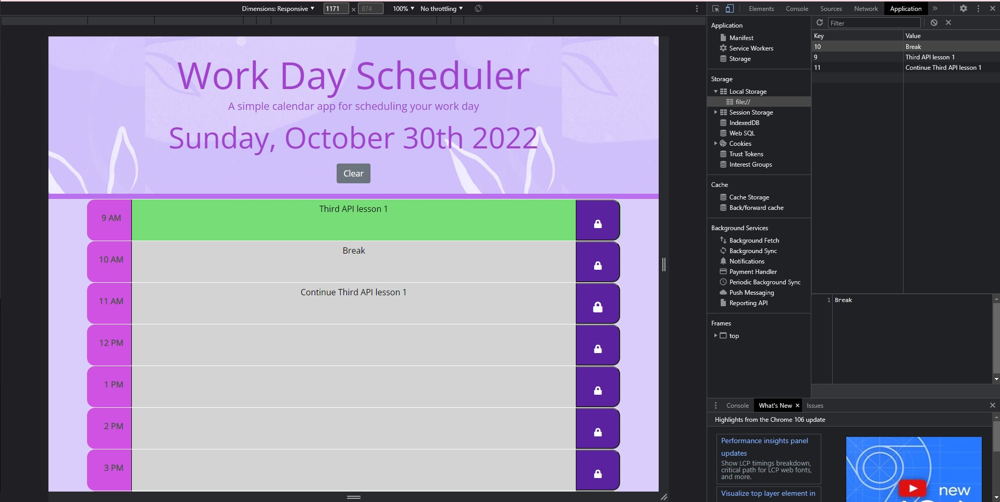
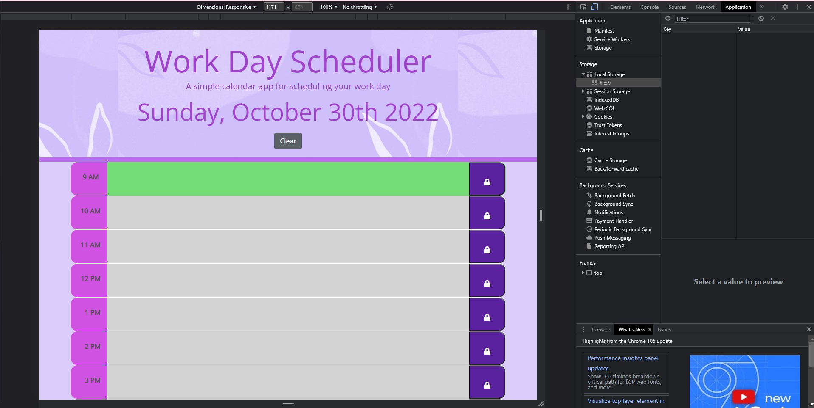

# Work-Day-Scheduler

## Description

This application is called Work Day Scheduler which allows you to input your schedule or events following by hour. In this case, the hour will start from 9AM to 5PM. Your input date will be save in local storage when you click on the save button. Click "Clear" button clear the data and data in local storage.

You will see the different color-coded at certain time block. They indicated whether the time is in the past, present or future

## Usage

This shows the layout of my application.

You can input your data by clicking into the time block.

Click save button to save your data in local storage.

Click clear button to clear the data

## Credit

N/A

## License

Please refer to the license in the repo.
